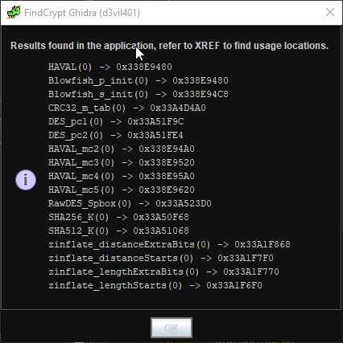

# FindCrypt

## Installation

### Windows

1. Find your Ghidra installation directory (e.g. `E:\Reversing Softwares\ghidra_9.0`)
2. Move `FindCrypt.java` into `Ghidra\Features\BytePatterns\ghidra_scripts`
3. Move `database.d3v` (database directory) into `C:\Users\your user`
4. Be sure Ghidra can access the `findcrypt_ghidra` directory both for reading and writing.

### Linux

1. Find your Ghidra installation directory (e.g. `~/ghidra`)
2. Move `FindCrypt.java` into `~/ghidra/Features/BytePatterns/ghidra_scripts`
3. Move `database.d3v` (database directory) into `~/` (or `$HOME`)
4. Be sure Ghidra can access the `~/findcrypt_ghidra` directory both for reading and writing.

## Usage

Once you started your project and opened the disassembler, use the Script Manager window and search for `FindCrypt.java`, by double clicking or pressing "Run" will execute the script and a result screen is shown if something is found.

### 

## Database

The database is a binary file I serialized myself, it's very easy to understand and very basic but functional for its goal. The database contains all of the **79** algorithms constants implemented by Ilfak, no sacrifices have been made while migrating them, while also adding more and more by the contributors.

There's a total of **122 detectable constants** in the database, related to:

- **Raw Primitives**
  - Keccak (SHA-3)
- **Elliptic Curves**
  - Donna32 (EC25519), Donna64 (EC25519)
- **Stream ciphers**
  - Chacha, Salsa, Sosemanuk
- **Block ciphers**
  - Blowfish, Camellia, DES, TripleDES, RC2, SHARK, Cast, Square, WAKE, Skipjack, HIGHT, Kalyna, LEA, SEED, SCHACAL2, SIMON-64, SIMON-128, TEA/TEAN/XTEA/XXTEA
- **Hash funcions**
  - Whirlpool, MD2, MD4, MD5, SHA-1, SHA-256, SHA-384, SHA-512, Tiger, RIPEMD160, HAVAL, BLAKE2
- **AES Family**
  - AES, RC5/RC6, MARS, Twofish, CAST-256, GOST, SAFER
- **Compression**
  - ZLib

## Database Updating

The script is now using an internal auto update system synchronized with the latest database version in this repository. The centralized repository synchronization is by default turned on, this is to ensure the user always has the latest version possible and therefore obtain best results from the script, if you wish to turn it off:

1. Open the `FindCrypt.java` file and find the `__FORCE_NO_DBUPDATE` variable (line 705).
2. Replace `false` with `true`.

## Script Updating

While the database is by design modular and can be updated automatically, the script can not; but the script will check the current version and prompt the user to check this repository latest version for download, with the list of changes from the new version.

The script update message is prompt only once per session.

Proceed to download the latest version of `FindCrypt.java` and replace it in Ghidra's script directory.

Also this feature is turned on by default, if you wish to disable it, follow above mentioned steps on `__FORCE_NO_SCRIPTUPDATE` (line 707).
